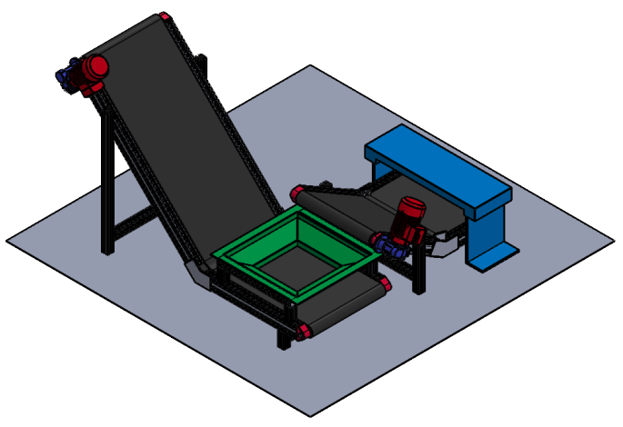
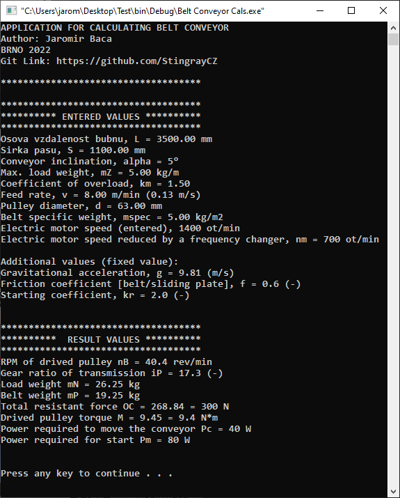

# Summary of ITC Projects

## Calculator for Belt Conveyor (lang C)

Applicatiohn for mech. calculations as support development of Belt Conveyor (click <a href="https://github.com/StingrayCZ/Belt-Conveyor-CalcApp/blob/main/README.md"> here</a> for see more details).

[//]: # (  )
  

## Python

## JavaSript